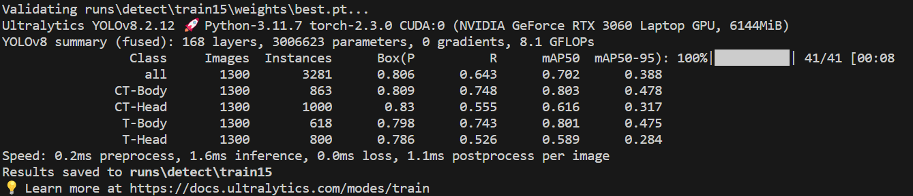

# Proj 2 report

## Aimbot for cs2

---


## Content 

```
|__0.Aimbot code user guide
|
|__1.Proj Background
|    |__1.1 mission profile
|    |__1.2 AimBoT Preliminary Questions: Research
|        |__1.2.1 Computer Vision Localization (Object Detection, Human Body Key Point Detection)
|        |__1.2.2 Common AI Questions
|
|__2.Proj Procedure
|    |__2.1Procedure of the project.
|    |__2.2Problems during proj & my solution
|    |__2.3specific configuration file explanation
|    |__2.4result evaluation
|
|__3.User_guid

```


## 0.Aimbot code user guide 
In case you'd like to test the correctness of the code before reading the report.
Go to 
[user_guide](#1)

## 1.Proj Background

### 1.1 mission profile
AimBoT问题定义

AimBoT通常是指在视频游戏中使用的自
动瞄准机器⼈（Aimbot）。这是⼀种作
弊程序，通过软件或脚本自动锁定敌⼈，
并在玩家发射武器时自动瞄准敌⼈。
AimBoT通常用于射击游戏，如第⼀⼈称
射击游戏（FPS）或第三⼈称射击游戏
（TPS），它们帮助玩家在游戏中获得非
常精准的射击

### 1.2 AimBoT Preliminary Questions: Research

#### 1.2.1 Computer Vision Localization (Object Detection, Human Body Key Point Detection)

Q1: What type of CV model is used?

这里我们选择了yolov8模型来构建aimbot，一方面YOLO（You Only Look Once）系列模型在目标检测任务中表现优异，它同时结合了实时性能、高精度、轻量级、多尺度检测和易于集成等优势，使其成为构建 aimbot AI 的理想选择。通过利用 YOLOv8 的这些特性，可以构建出高效、准确且响应迅速的 aimbot 系统，提高游戏体验。另一方面，大部分优质公开数据集使用了yolov8标签格式，选取这个模型也方便了后续步骤。

<details> <summary>具体原因</summary>

1.实时性能：
YOLOv8 在保持高精度的同时，还具有较快的推理速度，能够满足 aimbot 对实时检测和响应的需求。

2.高精度：
YOLOv8 在目标检测任务中表现出色，能够准确检测和定位目标，这对 aimbot 的精度和有效性至关重要。

3.轻量级：
YOLOv8 相较于其他复杂的目标检测模型更为轻量，适合在有限的计算资源下运行，例如游戏环境中的嵌入式系统或移动设备。

4.多尺度检测：
YOLOv8 能够检测不同尺度的目标，这对于处理游戏中可能出现的远近不同的目标非常重要。

5.易于集成和使用：
YOLOv8 提供了简单易用的 API 和丰富的文档支持，方便开发者快速集成到 aimbot 系统中。

6.社区支持和更新：
由于 YOLO 系列模型有广泛的社区支持和持续的更新维护，使用 YOLOv8 可以获得最新的研究成果和技术支持。

7.可定制性：
YOLOv8 模型支持定制训练，可以根据具体游戏场景和目标数据进行微调，提高在特定应用中的表现。

</details>

Q2: How is the dataset obtained?

数据集来源于 https://universe.roboflow.com/ 网站上的公开数据集，这里选择数据集时要考虑与yolov8模型对应的数据集格式。

### 1.2.2 Common AI Questions

#### Q1: What is pre-training, and what is fine-tuning?

**Pre-train**（预训练）和**fine-tune**（微调）通常用于提升模型的性能和适应性。

**Pre-train** （预训练）

预训练是指在一个大规模的通用数据集上训练模型，使其能够学习到丰富的特征表示。这种训练通常是无监督的或自监督的，也可以是有监督的。预训练的目标是让模型在广泛的数据上学习到通用的模式和特征，这些模式和特征可以迁移到特定任务中。

**优点：**
1. **节省时间和计算资源**：在大规模数据集上预训练模型可以节省从零开始训练模型的时间和计算资源。
2. **提高性能**：通过在大规模数据集上预训练，模型可以学习到更丰富和泛化的特征，从而在特定任务中表现更好。
3. **加速收敛**：预训练的模型在微调时通常收敛得更快，因为它已经学习了一些有用的特征。

**Fine-tune（微调）**
微调是在特定任务的数据集上对预训练模型进行进一步训练，以便适应该特定任务的需求。微调通常是在有监督的情况下进行的，即使用带标签的数据进行训练。

**过程：**
1. **加载预训练模型**：从预训练阶段得到的模型通常在某些大规模通用数据集上训练。
2. **冻结部分层**：有时会冻结模型的前几层，只对最后几层进行训练，以便保留预训练时学到的通用特征。
3. **使用特定数据集训练**：在特定任务的数据集上继续训练模型，调整模型参数，使其在该任务上表现更好。

**优点：**
1. **提高适应性**：通过微调，预训练模型可以适应特定任务的数据分布和需求，提高特定任务的性能。
2. **灵活性**：微调允许开发者根据具体任务的需求调整模型的架构和参数，从而获得更好的结果。

**例子**
在计算机视觉中，常见的做法是先在 ImageNet 数据集上预训练一个卷积神经网络（如 ResNet、VGG），然后在特定任务的数据集（如猫狗分类、车牌识别）上进行微调。同样，在自然语言处理（NLP）中，BERT、GPT 等模型通常在大规模文本数据上进行预训练，然后在特定任务（如情感分析、机器翻译）上进行微调。

**总结**
- **Pre-train（预训练）**：在大规模通用数据集上训练模型，学习通用特征。
- **Fine-tune（微调）**：在特定任务的数据集上进一步训练预训练模型，使其适应具体任务的需求。

这两种方法结合使用，可以有效提升模型在特定任务中的性能，节省训练时间和资源。

#### Q2: What is the format of the dataset?
```
├─test
│  ├─images
│  └─labels
├─train
│  ├─images
│  └─labels
└─valid
    ├─images
    └─labels
```

文件夹结构是一个用于训练目标检测模型的数据集结构，为YOLO格式。每个文件夹（`train`, `test`, `valid`）下都有 `images` 和 `labels` 子文件夹。`images` 文件夹包含图像文件，`labels` 文件夹包含与这些图像对应的标签文件。

**YOLO 格式说明**
在 YOLO 格式中：
- **图像文件**：通常是 `.jpg`, `.png` 等格式。
- **标签文件**：每个图像文件有一个对应的标签文件，标签文件的扩展名通常是 `.txt`。标签文件的内容格式如下：
  ```
  class_id center_x center_y width height
  ```

  每一行代表一个对象，包含以下信息：
  - `class_id`：对象的类别ID
  - `center_x`, `center_y`：对象的中心点坐标（相对于图像宽度和高度进行归一化）
  - `width`, `height`：对象的宽度和高度（相对于图像宽度和高度进行归一化）

**数据集示例**
假设有一个图像 `image1.jpg` 和对应的标签文件 `image1.txt`。

**`image1.jpg` 位于：**
```
train/images/image1.jpg
```

**`image1.txt` 的内容是：**
```
0 0.5 0.5 0.3 0.4
1 0.3 0.7 0.2 0.2
```
表示图像中有两个对象，第一个对象属于类别 `0`，第二个对象属于类别 `1`。


#### Q3: Is the data quantity insufficient, and is data augmentation needed?

在数据量不足的情况下，数据增强是提高模型性能的有效方法。通过引入各种变换和噪声，数据增强可以生成更多的样本，帮助模型更好地泛化和减少过拟合。通过结合数据增强技术，YOLOv8模型可以在不同场景下表现得更好。

在 YOLOv8 中，默认情况下训练过程中会应用各种数据增强技术，数据增强操作在 YOLOv8 的训练过程中默认启用，可以通过修改训练参数来调整这些数据增强操作的强度和类型。

<details> <summary>常用的数据增强技术</summary>

**翻转和旋转**
水平翻转：水平翻转图像。
垂直翻转：垂直翻转图像。
旋转：旋转图像一定角度（如90度、180度、270度）。

**缩放和裁剪**
随机裁剪：从图像中随机裁剪一个部分。
缩放：对图像进行缩放，使其大小变化。

**平移和仿射变换**
平移：对图像进行水平或垂直平移。
仿射变换：包括缩放、旋转、平移和剪切等操作。

**颜色变换**
亮度调整：随机调整图像的亮度。
对比度调整：随机调整图像的对比度。
饱和度调整：随机调整图像的饱和度。
色调调整：随机调整图像的色调。

**添加噪声**
高斯噪声：向图像中添加高斯噪声。
椒盐噪声：向图像中添加椒盐噪声。

**模糊和锐化**
高斯模糊：应用高斯模糊，使图像变得模糊。
锐化：增强图像的锐利度。

**数据增强的好处**
增加数据量：通过对现有数据进行变换，生成新的样本，增加数据量。
提升模型泛化能力：通过生成多样化的数据，模型能够更好地适应不同的场景和变化，提高泛化能力。
减少过拟合：数据增强可以通过引入更多的变异性来减少过拟合现象，使模型在测试数据上表现更好。
</details>

#### Q4: What is the model evaluation method?
在 YOLOv8 中，模型评估通常包括以下几个方面：

1. **Precision (精度)**: 精度表示模型预测的正样本中实际为正样本的比例。计算公式为：
   \[
   \text{Precision} = \frac{TP}{TP + FP}
   \]
   其中，TP 是真正例，FP 是假正例。

2. **Recall (召回率)**: 召回率表示实际为正样本中被模型正确预测为正样本的比例。计算公式为：
   \[
   \text{Recall} = \frac{TP}{TP + FN}
   \]
   其中，FN 是假负例。

3. **mAP (Mean Average Precision, 平均精度均值)**: mAP 是评估目标检测模型性能的一个重要指标。它是对所有类别的平均精度 (AP) 的均值。AP 是在不同 IoU 阈值下计算的精度和召回率曲线下的面积。具体步骤如下：
   - 计算每个类别的 AP。
   - 计算所有类别的 AP 的平均值，即 mAP。

4. **IoU (Intersection over Union, 交并比)**: IoU 是用于衡量预测边界框与真实边界框重叠程度的指标。计算公式为：
   \[
   \text{IoU} = \frac{\text{Intersection Area}}{\text{Union Area}}
   \]
   IoU 值越大，表示预测边界框与真实边界框的重叠程度越高。

5. **F1 Score**: F1 分数是精度和召回率的调和平均数，计算公式为：
   \[
   F1 = 2 \cdot \frac{\text{Precision} \cdot \text{Recall}}{\text{Precision} + \text{Recall}}
   \]
   F1 分数在精度和召回率之间进行权衡，是一个综合指标。

## 2.1Procedure of the proj

1.项目整体了解
2.参数理解及训练集准备
3.针对代码开始训练
4.实时截屏实现及，模型加载代码重构
5.将代码整合，完成初步识别效果
6.鼠标监听及控制

## 2.2Problems during proj & my solution

**1.数据质量问题**
在Object Detection任务的数据集中，存在影响模型判断的图片内容通常可以归结为“数据质量问题”。这些问题可能会导致模型在训练和推理阶段产生不准确的预测。具体来说，这些问题包括：

### 数据质量问题

1. **噪声数据（Noisy Data）**：
   - 图像中包含与目标无关的杂乱背景、遮挡物、或其他不相关的物体，这些内容可能会干扰模型的判断。

2. **模糊或低质量图像**：
   - 图像模糊、分辨率低或图像中存在大量压缩伪影，可能会使模型难以识别目标。

3. **光照变化**：
   - 光照条件变化较大，如强光、阴影、夜间拍摄等，可能会影响模型的检测性能。

4. **不一致的标注**：
   - 图像标注不一致，或标注存在错误，如漏标、误标等，这些问题会影响模型的学习效果。

5. **类间相似性高**：
   - 图像中存在大量外观非常相似的类别，可能会导致模型难以区分这些类别。

### 解决方法

1. **数据清洗**：
   - 手动或自动地清理数据集，去除或修正噪声数据和低质量图像。

2. **数据增强**：
   - 使用数据增强技术来增加数据的多样性和鲁棒性，例如旋转、缩放、平移、亮度调整等。
   - 示例代码：

3. **统一标注标准**：
   - 确保标注的一致性和准确性，制定详细的标注指南，定期审核标注质量。

4. **平衡数据集**：
   - 确保数据集中各类别的样本数量相对平衡，避免数据偏斜。

5. **数据清理和过滤**：
   - 通过自动或手动的方式清理和过滤数据集，移除质量较差的图像。
   

通过以上方法，可以有效地提高数据集的质量，从而提升Object Detection模型的性能和鲁棒性。

**2.过拟合**
过拟合（Overfitting）是机器学习模型在训练数据上表现得很好，但在未见过的测试数据或新数据上表现不佳的现象。它通常是由于模型过于复杂，能够捕捉到训练数据中的噪声和偶然模式，而不是学习到数据的总体趋势和规律。以下是一些过拟合的要点：

1. **复杂模型**：模型的复杂度太高，有太多的参数，能够记住训练数据中的每一个细节。
2. **高训练精度，低测试精度**：在训练数据上取得很高的准确率或低误差，但在测试数据上表现不佳，准确率降低或误差增加。
3. **缺乏泛化能力**：模型不能很好地泛化到新数据，无法从训练数据中提取出有意义的模式和规律。
4. **症状**：
   - 训练误差和测试误差之间差异显著。
   - 训练过程中，训练误差持续下降，但测试误差在某个点之后开始上升。
5. **原因**：
   - 数据量不足：训练数据不够丰富，模型过度拟合了有限的数据样本。
   - 噪声影响：训练数据中存在噪声或异常值，模型过度拟合了这些噪声。
   - 模型复杂度高：使用了过于复杂的模型，如深层神经网络、大量参数等。
6. **预防和解决方法**：
   - 使用更多的数据：增加训练数据量，帮助模型学习到数据的总体趋势。
   - 正则化：添加正则化项（如L1或L2正则化）来惩罚过于复杂的模型，防止过拟合。
   - 交叉验证：使用交叉验证来评估模型的性能，选择合适的模型和参数。
   - 简化模型：减少模型的复杂度，如减少神经网络的层数或节点数。
   - 数据增强：通过数据增强技术生成更多的训练数据，提高模型的泛化能力。

过拟合是机器学习中的常见问题，理解其原因和解决方法对于构建能够泛化到新数据的有效模型至关重要。


## 2.3specific configuration file explanation
**配置文件示例**

以下是一个 `data.yaml` 文件的示例：

```yaml
train: ./train/images
val: ./valid/images

nc: 5  # 类别数量
names: ['class0', 'class1',...]  # 类别名称
```

通过这种方式，可以方便地对 YOLOv8 模型进行训练和评估，了解模型在不同评估指标上的性能，从而进行优化和改进。

## 2.4result evaluation

下面是模型的具体评估结果：


对结果详细分析

### 性能评估
1. **总体性能**：
   - **mAP@0.5（70.2%）**：这个值表示在IoU阈值为0.5时，模型的平均精度是70.2%。这个结果在很多目标检测任务中是不错的，尤其是在复杂的多类别检测任务中。
   - **mAP@0.5:0.95（38.8%）**：这个值表示在更严格的IoU阈值范围内（从0.5到0.95，步长为0.05）的平均精度。这是一个更严格的指标，38.8%在很多应用中也是可以接受的。

2. **各类别性能**：
   - **CT-Body（mAP@0.5:0.95 = 47.8%）**：这个类别的检测效果最好，精度和召回率都很高，说明模型在检测CT-Body时表现非常好。
   - **CT-Head（mAP@0.5:0.95 = 31.7%）** 和 **T-Head（mAP@0.5:0.95 = 28.4%）**：这两个类别的性能较低，说明模型在这两个类别上可能存在一些问题，例如数据不足、数据质量不高或类别区分度不够。

### 其他因素
1. **应用场景**：
   - 如果你的应用场景对精度要求非常高（例如医疗图像分析、安全监控等），那么这些结果可能需要进一步优化。
   - 如果是用于一般的物体检测任务，这个结果是可以接受的。

2. **数据集质量**：
   - 模型性能在很大程度上依赖于训练数据的质量和多样性。如果数据集本身存在问题（如标签不准确、样本不均衡等），可能需要对数据集进行清理和增强。

3. **模型优化**：
   - 可以通过调整模型的超参数、进行数据增强、使用更好的训练策略等方法来提高模型的性能。
   - 可以考虑使用迁移学习，将预训练的权重应用到你的数据集上。

### 总结
- **优点**：YOLOv8在大多数类别上的表现是不错的，尤其是在CT-Body类别上。
- **缺点**：CT-Head和T-Head类别的性能较低，需要进一步优化。

根据具体应用的需求，进一步评估和优化模型性能可能是必要的。如果对检测精度要求较高，可以尝试通过调整模型、增强数据集等方法来提升结果。
</details>

**模型评估的具体步骤**

1. **分割数据集**：将数据集分割为训练集、验证集和测试集。
2. **训练模型**：使用训练集进行模型训练，并在验证集上进行超参数调优。
3. **评估模型**：在测试集上评估模型性能，使用上述指标（如精度、召回率、mAP、IoU 和 F1 分数）进行评估。

<h2 id="1">3.user_guide</h2>
注：由于仓库中也存在前期训练时的一些存在问题的模型和结果，所以请以https://github.com/kevinyao0901/AI_fundation/blob/main/Project2/cs_png的运行结果样例为准，
同时请采用model_path=r'D:\courseware\AI基础\Lab\proj2\ultralytics-main\ultralytics-main\aim-csgo\models\best.pt'对应路径下的模型

下面是在静态图片上运行模型进行预测的结果示例:
**CT:**
|  |  |
|:------------------------------:|:------------------------------:|
|          Origin          |          Predict          |

**T:**
|  |  |
|:------------------------------:|:------------------------------:|
|          Origin          |          predict          |


运行测试方法：
在\Project2\ultralytics-main\ultralytics-main>目录下运行如下命令：
yolo task=detect mode=predict model=runs/detect/train6/weights/best.pt conf=0.25 source='ultralytics/assets/cs.jpg'
可根据需要检测的图片替换source

关于如何使用本aimbot：
在ultralytics-main\ultralytics-main\aim-csgo\路径下直接运行main.py即可。当然可能需要配置一些python库环境。
开始运行后可输入自己的阵营ct/t，
使用shift键开启辅助瞄准。


